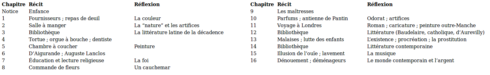

# Flux 

An application architecture for React

---

### Flux Design

- Dispatcher: Manages Data Flow
- Stores: Handle State & Logic
- Views: Render Data via React

---

---

<section>
	
Appears last

	
Appears first

	
Appears second

</section>

---

